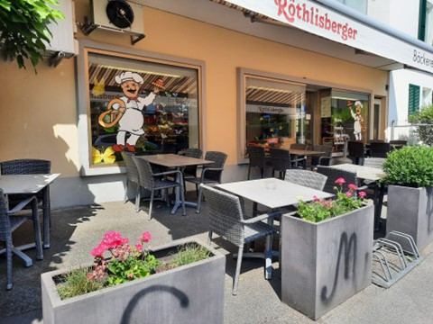
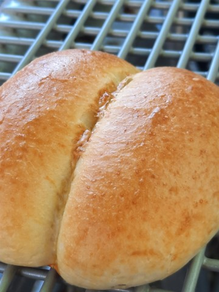

+++
title = "Die Brotkultur der Schweiz "
date = "2023-06-18"
draft = false
pinned = false
image = "rothlisberger.jpg"
description = "Eine Reportage von Julia Streit und Zoe Kearns "
footnotes = "#### Quellenangaben\n\n\r\n\r\n* Bäckerei Röthlisberger: *Startseite*, [https://www.baeckerei-roethlisberger.ch/ ](https://www.baeckerei-roethlisberger.ch/)(zuletzt abgerufen 31.05.2023)\r\n* Kulinarisches Erbe der Schweiz: *Weggli,* <https://www.patrimoineculinaire.ch/Produkt/Weggli-Petits-pains-au-lait-Panini-al-latte/157>(zuletzt abgerufen 02.06.2023) \r\n* Alimentarium: *Die Geschichte des Ackerbaus,* <https://www.alimentarium.org/de/fact-sheet/die-geschichte-des-ackerbaus#:~:text=Ackerbau%2C%20so%20genannt%20wegen%20der,etwa%2011%20000%20Jahren%20betrieben.>(zuletzt abgerufen 09.06.2023)\r\n* Geolino: *Die Geschichte des Brotes,* <https://www.geo.de/geolino/mensch/3954-rtkl-brot-die-geschichte-vom-brot>(zuletzt abgerufen 09.06.2023)\r\n* Lernhelfer: *Treibmittel,* <https://www.lernhelfer.de/schuelerlexikon/chemie/artikel/treibmittel>(zuletzt abgerufen 10.06.2023)\r\n* Interview, Bilder und mündliche Umfrage sind aus eigener Produktion\r\n"
+++
# Die Brotkultur der Schweiz


Was ist heiss und knusprig? Richtig, ein altes Weggli in der Mikrowelle. Ein Blick auf eine regionale Bäckerei in Bern und die Geschichte hinter einem der beliebtesten Schweizer Gebäcke. 


Ob nun vom Sportunterricht in der Schönau zurückgeschlendert, auf dem Weg zur Arbeit daran vorbeigefahren oder nach einem stressigen Tag etwas Süsses für die Nerven gebraucht wird, die Bäckerei Röthlisberger lädt mit den niedlichen Rundtischen und Stühlen zum Ausspannen und Geniessen ein. Auch im Gebäude selbst laden Sitzgelegenheiten und stetig aktuelle und abwechslungsreiche Dekorationen zum Bleiben ein. Wenn man den Laden betritt, ist das Erste, was zu sehen ist, die Theke, hinter der am Standort Kirchenfeld meistens eine ältere Dame und ein Knabe in der Ausbildung stehen, die dort Wünsche entgegennehmen und erfüllen. Links am fester befindet sich der innere Aufenthaltsbereich, der durch dekorierte Holzkisten vom Rest des Ladens abgetrennt ist. Hinten links in der Ecke steht ein hohes gekühltes Regal mit Getränken alle Art. Der Raum ist wohltemperiert und es liegt eine rundum entspannte Stimmung in der Luft, die Zeit scheint langsamer zu vergehen. Vom grossen Tresen in der Mitte der hinteren Wand lachen einen Sandwiches mit Käse- und Schinkenfüllung an. Der Duft von frischen Gebäcken zieht durch den Raum. 

Die Bäckerei Röthlisberger hat im Jahr 1995 ihre erste Verkaufsstelle im Kirchenfeldquartier eröffnet. In den nun fast schon 30 Jahren seit ihrer Ersteröffnung hat sich der Familienbetrieb, der aus drei Mitarbeitenden besteht, auf einen Betrieb von über 6o Mitarbeitenden erweitert. Insgesamt hat die Bäckerei Röthlisberger heutzutage fünf Verkaufsstellen mit Standorten im Kirchenfeld, Wabern, Ostring, Monbijou und in Ostermundigen. Zusätzlich zu den normalen Verkaufsstellen gibt es an den Standorten Kirchenfeld und Wabern ein Bistro und die Möglichkeit eine warme Mahlzeit zum Zmittag zu geniessen. Die Verkaufsstelle Wabern ist zudem eine Schaubäckerei, bei der die Backstube vom Verkaufsraum und Bistro aus beobachtet werden kann. Die verschiedenen Standorte der Bäckerei Röthlisberger bringen auch die verschiedensten Kunden. Von Schülern über Familien zu Handwerkern, all diesen Leuten gilt es etwas Passendes anzubieten. Auch wenn dieses, doch sehr verschiedene Klientel ihre Herausforderungen mit sich bringt, hat die Bäckerei Röthlisberger Erfolg darin sie zufrieden zu stellen. 

Neben Gipfeli, Züpfe und Brot sind bei der Bäckerei Röthlisberger noch viel mehr Produkte zu erhalten. Neben den klassischen Gebäcken, die in einer Bäckerei zu finden sind, sind bei der Bäckerei Röthlisberger zudem Snacks und andere Produkte zum Zmorgen als Laugengipfel und Vollkornbrot erhältlich, wie zum Beispiel ein frisch zubereitetes Birchermüesli. Zum Znüni kann ein frisch gebackenes Weggli, Schinkenkipfeli oder Sandwich gekauft werden und als Dessert gibt es einen leckeren Kuchen, Kekse oder Nussgipfel zum Geniessen. Laut anonymer Quelle aus dem Gymnasium Kirchenfeld, ist vor allem das Weggli sehr zu empfehlen und eines der besten, welches in der Region erhältlich ist. Die Bäckerei Röthlisberger legt viel Wert darauf, dass ihre Materialien von guter Qualität sind und aus der Region kommen. Damit setzt die Bäckerei auch auf die Nachhaltigkeit ihrer Produkte und ihres Geschäftes. 

Heutzutage umfassen die fünf Verkaufsstellen der Bäckerei Röthlisberger in der Region Bern über 60 Mitarbeiter. Die Anzahl an Angestellten Personen hat sich also in den letzten knapp 30 Jahren über das 20-fache vergrössert. Die Bäckerei Röthlisberger hat mehrere Standorte in der Region Bern und bietet neben Arbeits- auch Ausbildungsplätze an. Zudem ist die Bäckerei in verschiedenen Integrationsprogrammen involviert. 

### Die Schweizer Gesellschaft und Bäckereien

Ob am Sonntagmorgen ein Gipfeli oder eine Züpfe zum Zmorgen gekauft wird, zum Zmittag ein Brötli oder Sandwich, am Dienstag Abend ein Brot fürs Znacht oder ein Kuchen zum Dessert als Mitbringsel zu einem Besuch, Bäckereien sind ein wesentlicher und wichtiger Bestandteil unserer Gesellschaft. In der Schweiz hat es eine Vielzahl an Bäckereien. In jeder Ortschaft hat es einen Beck in dem man sein Weggli für das Znüni oder Zvieri kaufen kann. Oftmals gibt es ein angehängtes Bistro, in dem ein warmes Kaffee oder leckeres Dessert genossen werden kann. In Städten ist die Anzahl an Bäckereien oft sehr gross, es wimmelt schon fast an Bäckereien, auch in Bern ist es nicht anders. Die Auswahl an verschiedenen Produkten ist vielmals gross, wenn auch ähnlich zu anderen Geschäften einschliesslich gewöhnlichen Lebensmittelläden. Trotzdem haben viele eine Stamm- oder Lieblingsbäckerei, anstatt ihre frisch hergestellten Gebäcke und Desserts vom Coop oder vom Migros zu beziehen. Bäckereien legen grossen Wert darauf ihre saisonal angepassten Produkte aus hochwertigen und regionalen Materialen zu backen.

### Die beliebtesten Gebäcke am Gymnasium Kirchenfeld

Eine inoffizielle Befragung einiger Leute am und ums Gymnasium Kirchenfeld hat ergeben das Mutschli sehr beliebte Backwaren sind und auch Laugenbrötchen sind gehen nicht schlecht weg. Natürlich ist auch das Gipfeli sehr populär, denn Gipfeli sind rundherum toll! Sie sind weich, luftig, leicht und schmecken super. Noch dazu gibt es Gipfeli mit Füllung aller Art. Schinken, Käse, Schokolade, Vanillecreme und noch viel mehr. Überraschenderweise gibt es jedoch ein Kleinbrot, welches sogar die Vielfalt der Gipfeli übertrifft. Das Weggli. Es ist simpel, lecker und weckt kombiniert mit einem Schoggistängeli Kindheitserinnerungen und Nostalgie in befragten auf. Genau deshalb sollte das Weggli ein Bisschen näher angesehen werden. 



### Das Weggli

Das Weggli ist vielerorts beliebt und ist daher auch unter vielen Namen bekannt. Was in den meisten Regionen ein Weggli ist, ist im Graubünden ein Milchbrötchen und in Basel ein Schwöbli oder noch eigenartiger, ein Mutschli für die Leute aus einigen Teilen Unterwaldens, wo doch eigentlich alle wissen, dass ein Mutschli und ein Weggli nicht dasselbe sind. Doch trotz der unterschiedlichen Namen ist das Brot an sich wie jedes andere Brot, mit den Hauptzutaten Wasser, Mehl und Hefe, doch was es so speziell macht sind die Butter und das Milchpulver die dazugegeben werden, zusammen mit einer Prise Salz als Geschmacksverstärker, die zusammen dem Weggli seinen Geschmack und diese weiche Konsistenz verleihen. Das Weggli ist heutzutage eines der wohl meistgeliebten Gebäcke der Schweizer. Doch Weggli waren nicht immer so frei zugängig wie sie heute sind. Bis in das 20. Jahrhundert waren Weggli nämlich Luxusprodukte, da sie aus Weissmehl bestehen. Weissmehl war zu der Zeit wesentlich teurer als anderes Mehl, was dazu führte das Wegglis teuer waren. Bis heute gibt es einige Sprichwörter welche sich auf Weggli beziehen, was zeigt, dass Weggli schon immer beliebt waren. Ein Sprichwort, welches einigen bekannt sein wird, ist «den Fünfer und das Weggli haben wollen». Das Sprichwort bezieht sich auf den damaligen Preis eines Wegglis und sagt aus, dass jemand zwei Sachen gleichzeitig haben möchte, obwohl man das erste für das zweite abgeben müsste. 



### Die Geschichte des Brotes

Vor etwa 10'000 Jahren begannen Menschen auf dem sogenannten fruchtbaren Halbmond, ein Gebiet zwischen dem Mittelmeer und dem persischen Golf, den Anbau von Urgetreide wie Emmer und Einkorn und Sesshaft zu werden. Zuerst wurden die Körner der Pflanzen roh konsumiert. Danach wurden die Körner zermahlen und mit Wasser zu einem Brei angerührt, anders gesagt: Das erste Mehl wurde verarbeitet. Offenbar legte dann jemand diesen Mehlbrei eines Tages zufällig oder mit Absicht auf einen heissen Stein, was dazu führte, dass der Brei zum ersten Fladenbrot der Menschheitsgeschichte trocknete, ein Nahrungsmittel, das seither nicht mehr wegzudenken ist. Dünn, fest, haltbar und transportabel ist es perfekt als Mahlzeit, Proviant und Snack. Doch das war nur der Anfang. Vor etwa 6’000 Jahren zur Zeit der Hochkultur der alten Ägypter, wurde zum ersten Mal das gebacken, was wir als «richtiges» Brot bezeichnen würden. Die Ägypter entdeckten nämlich, dass wenn man den Teig vor dem Backen stehen lässt, er aufgeht und beim Backen dann ein luftiges Brot entsteht. Dies war der Beginn des Hefeteigbrotes.  



### Das Wirkungsprinzip der Hefe

Jeder Brotteig besteht im wesentlichem aus nur drei Zutaten, Wasser, Mehl und Hefe. Das Mehl muss den Eiweissstoff Gluten enthalten, der beim Kneten mit Wasser dafür verantwortlich ist das der Teig kleberig und zäh wird, er wirkt quasi als natürlicher Klebstoff. Der Teig muss deshalb so zäh sein, damit Gase nicht so leicht entweichen können. Das Kneten hat zusätzlich die Funktion, Sauerstoffbläschen im Teig einzuschliessen. Die Luft ist nötig damit die letzte Zutat, die Hefe, ihr volles Potential erreichen kann. Hefe sind kleine einzellige Pilze, die mit ihren Enzymen die Langkettigen Stärkemoleküle im Mehl in den Einfachzucker Glucose spalten, welchen sie dann mithilfe von Sauerstoff zu CO2 metabolisiert. Dieses CO2 benötigt mehr Platz als der Zucker, so bilden sich Gasblasen die beim Backen durch die hohe Temperatur nochmals ihr Volumen vergrössern bevor der Teig fest wird und diese feine Struktur der Gasblasen verfestigt, so dass das Brot auch nach dem Abkühlen seine luftige Struktur behält. 


Wenn die Welt der Bäckereien betreten wird, ist es fast unmöglich sich nicht von verlockenden Düften und Aromen verlocken zu lassen. Auch wenn die Backwaren aus einer Bäckerei teurer sein mögen als die aus der Migros oder dem Coop, lohnt es sich trotzdem Gebäcke aus regionalen Bäckereien zu beziehen.  Bäckereien sind ein wichtiger Teil der Schweizer Gesellschaft und bieten eine gemütliche Alternative zu den Migroweggli, die in einer ständig hektischen und auf Effizient getrimmten Welt, eine Minute zum Aufatmen und Entspannen bietet. In Bäckereien sind nicht nur Brot und andere Gebäcke zu finden, sondern auch eine Geschichte des Handwerks, der Tradition und vor allem des Genusses.